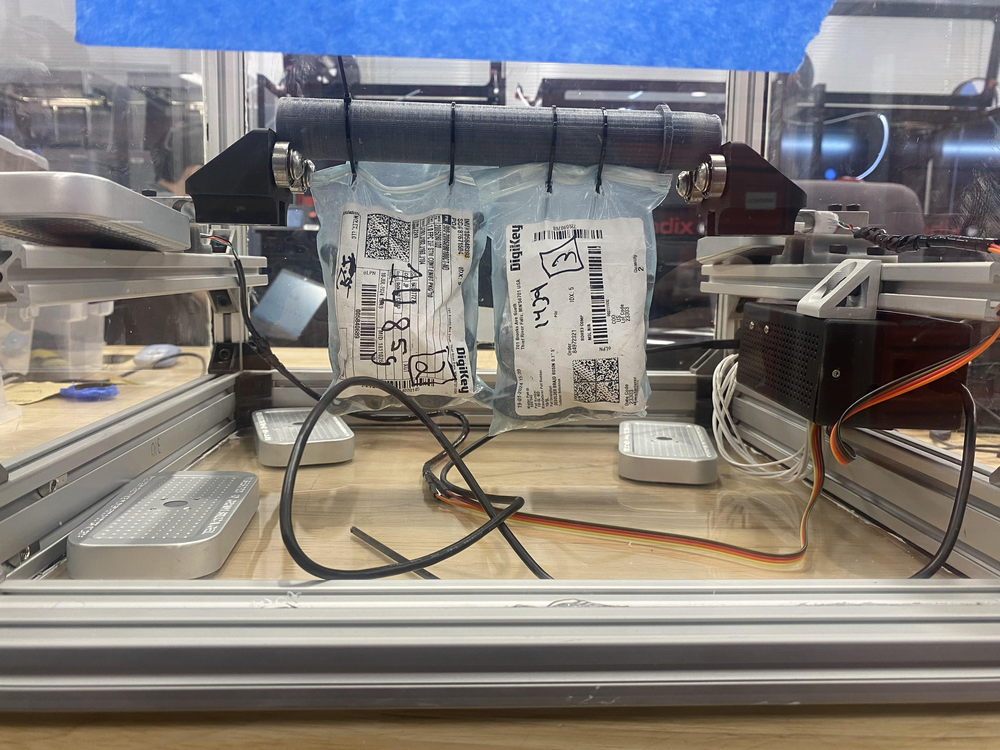

  To get acheive the rank of Eagle Scout, you must first achieve the rank of star scout, complete 21 merit badges, and multitude of various other public services. However, the most time intensive part of achieving the rank of Eagle is the Eagle Scout project, which requires you to complete a large public service
project that is completely orgonized and directed by the upcoming Eagle Scout. For my Eagle Scout project, I decided to help the two churches that sponsored my scout troop over the years. I noticed that these churches serviced a lot of elderly people and were too far from the local ambulance services to have
an effective medical responce if someone was to have a cardiac emergency. Because of this, a goal of buying two AEDs, priced $700 each, and training the local church goers how to use the AEDs was set as the final goal for my Eagle Project. 
  I held a handful of car washes with the rest of my troop to reach a 1500 dollar goal for buying and installing each AED into the churches. The car washes were all about 5 hours long and generated about 500 dollars for each car wash. The AEDs that I bought came with their own cases, boxes, and alarm systems, so 
installation of these boxes was fairly straightforward. I drilled both boxes into the concrete walls and placed the boxes where they were both noticable and easily accessible. Finally, I worked with the local fire departments to hold an AED training session with the church goers. Members of the fire department and
I supplied dummies, specialized CPR mannequins, and deactivated AEDs to show the church members how to identify and treat a heart attack before medical personnel arrive. The training was well-recieved by the church members of both churches and the AEDs were successfully installed in the churches. I was interviewed
about this project by the scout leaders and then I was awareded my Eagle Scout certification.

  
  

